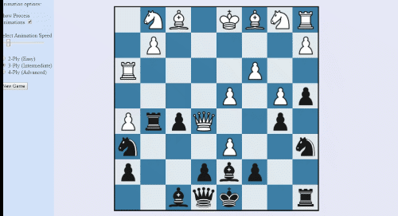
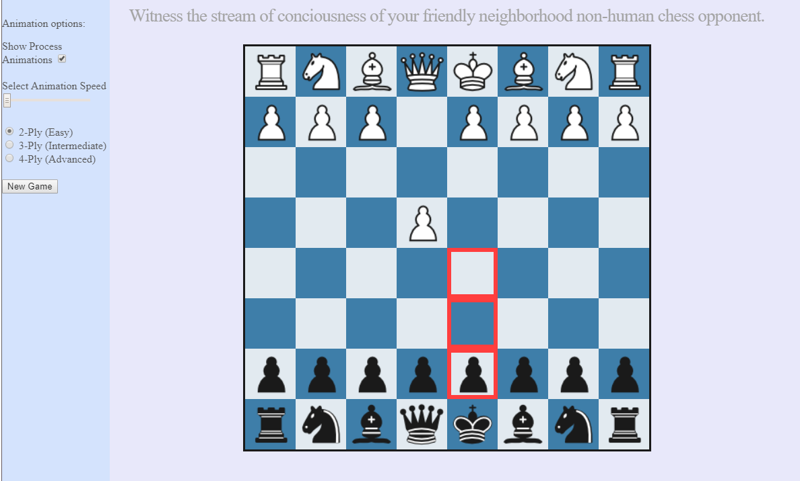

# Chess Algorithm visualization

Source code for web app <a href="http://visualchess.pythonanywhere.com/"> "Visualize Possible Chess Moves" </a>, which concisely displays up to hundreds of thousands of possible moves explored by a chess algorithm. The purpose of this program is aesthetic and artistic, as well as possibly educational.

As it plays chess against a human player, this app offers a customizable visualization of the possible-move tree traversed by an alpha-beta pruning minimax algorithm with fast move ordering. During this animation, the machine iterates through all legal moves and searches for the maximum strategic score assuming the human opponent will attempt to minimize this score. 

Customization (sidebar):
- Select machine's ply (i.e. depth of move tree search)
- Disable animation
- Select animation speed

              

About
  

                Legal chess move generation library: courtesy of
                <a href="https://github.com/jhlywa/chess.js/"> jhlywa </a>
                  
                This site is hosted using PythonAnywhere.com.
                 
                Information on chess AI:
                <a href="https://en.wikipedia.org/wiki/Evaluation_function#In_chess">
                static evaluation</a>,
                <a href="https://en.wikipedia.org/wiki/Minimax">minimax</a> and
                <a href="https://en.wikipedia.org/wiki/Alpha%E2%80%93beta_pruning">
                     alpha-beta pruning
                </a>

